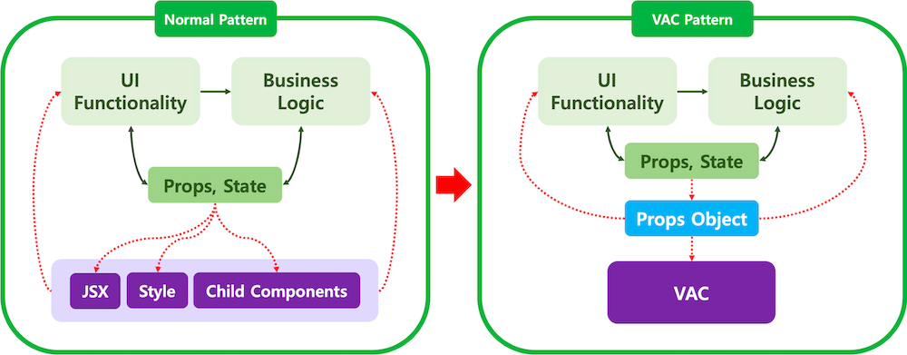

## VAC Pattern ?

VAC 패턴은 디자인패턴중 하나로, 컴포넌트 설계에서 비즈니스 로직과 View 로직을 완전히 분리 시키는 패턴이다. 이 패턴에 대해 학습한 계기는, 이전에 내가 작성해온 코드들을 살펴보면서 문제점을 생각하고 더 좋은 패턴이 없는지 알아보다가 해다아 패턴에대해 알게되었다.

> 요약 : VAC 패턴은 View 컴포넌트에서 JSX 영역을 Props Object로 추상화하고, JSX를 VAC로 분리해서 개발하는 설계 방법



흔히 VAC 패턴에 대해 찾아볼 수 있는 그림이다.

### Presentational and Container Pattern ?

VAC 패턴과 유사한 컴포넌트 설계 패턴인데 이 패턴도 로직과 UI를분리하는 패턴이다. (VAC 패턴 이전부터 유행하던 패턴이다.)
VAC 패턴은 Container 컴포넌트에 로직을 위임하는 설계 방식을 따르기 때문에 이 Presentational과 Container 컴포넌트 패턴의 한 종류.  
VAC 패턴과 근본 적인 차이는 컴포넌트가 View 로직을 가질 수 있는 지 여부로, VAC는 Presentational 컴포넌트보다 더 구체적인 기준을 제시하여 JSX를 처리하는 컴포넌트 관점에서 일관성 있는 설계를 하는데 도움을 준다.

### 지금까지 내가 컴포넌트 설계한 방법

VAC 패턴을 모르기전에 주로 나는 해당 컴포넌트가 “재사용”이 되는지에 초점을 맞춰 작업했었다.

1. 페이지 단위에서 작업한다고 가정했을때 해당 컴포넌트가 다른 페이지에서도 재사용되어지는지 ? 재사용된다면 적절한 props와 상태를 파악후 컴포넌트를 만든다.
2. TDD 방법으로 해당 컴포넌트 틀만 만들어놓고 테스트코드를 통과시킨다.
3. API 관련 로직을 분리하고, 비즈니스 로직도 재사용할 수 있다면 따로 뺀다.
4. UI css 작업을 진행한다.

> 결국, 나는 지금까지 상태와 해당 상태에 따라 변경되어지는 로직, 렌더링 되는 View UI 가 모두 하나의 컴포넌트에 작성되어있는 상태였다.

이러다보니…프로젝트의 크기가 커지면서 문제가 생겼다.

분명 두개의 컴포넌트는 완전 동일한 로직인데,  디자인의 크기나 배치가 완전 다른 경우가 있었다. 뷰와 로직을 같이 관리 하다보니 공통 컴포넌트화를 하지 못하고 2개의 컴포넌트를 만들게 되는 상황이 발생.
즉.. 디자인까지 얼추 같지 않다면 재사용을 완전히 못하겠구나라고 느꼈다.

### VAC pattern에 대한 필요성

위처럼 개발하다보니 컴포넌트와 CSS가 한곳에 있어서 프로젝트 규모가 점점 커지면서 디자인과 컴포넌트 개발하는데 힘들었고, 나중에 컴포넌트를 추가하고 리펙토링할때도 어려웠다.

VAC는 다음과 같은 특징을 지닌다.

1. 반복이나 조건부 노출, 스타일 제어와 같은 렌더링과 관련된 처리만을 수행
2. 오직 props를 통해서만 제어되며 스스로의 상태를 관리하거나 변경하지 않는 stateless 컴포넌트
3. VAC의 목적은 JSX에서 로직을 분리하여 렌더링에 집중하기 위함

## VAC 패턴 사용 사례

### 실제로 팀 프로젝트를 진행하면서 작업했던 코드.

```javascript
import { MapUserType } from '@/types/map'

const UserProfileView = ({ userProfile }: { userProfile: MapUserType }) => (
  <div className="flex items-center gap-4 mt-4">
    
    <span className="text-gray">지도 Host: {userProfile.host_nickname}</span>
  </div>
)

export default UserProfile
```

지금까지 작업한 여러 코드를 살펴보면서 리팩토링 하는 중인데 그중에서 UserProfile 컴포넌트를 약간 건드렸다.  
위 코드에서 원래는, userProfile도 같이 제어 했었던 컴포넌트 인데, userProfile을 Props로 받도록 수정하여 View의 역할만 하도록 수정하였다.

### VAC 패턴 사용 후기

장점 ?

1. 독립적인 페이지 UI 테스트 가능 : 이전에는 관심사를 재사용 위주로 분리하여서 각각의 컴포넌트 단위로만 스토리북을 생성하고 전체 UI의 경우 테스트 데이터를 전부 다 몰아넣고 테스트를 진행했지만 스토리북에서 실제 View에만 집중하면 되기 때문에 훨씬 좋았다.

2. 한눈에 파악하기 쉬운 코드들 & 유지보수: 비즈니스 View 따로따로 집중할 수 있어서, 나중에 다시 코드를 들여다봐도 쉽게 이해할 수 있었다.

단점 ?

1. 프로젝트 규모가 커지면 Props를 생각보다 많이 넘기는 상황
2. VAC 컴포넌트로 모두 분리하게 되면 로직과 뷰를 분리해야하기 때문에 파일의 개수가 많아져 유지보수가 생각보다 어렵다고 생각한다. 단순한 기능을 가진 컴포넌트 들도 VAC 패턴에 맞춰 로직과 스타일을 분리를 해야 할까 ? (지금당장 드는 생각은 단순한 컴포넌트들은 그대로 유지하고 한눈에 안 들어온다면 리팩토링하여 VAC 패턴으로 만들기.)

출처 : [[리액트] VAC 패턴 적용 후기 및 장단점](https://all-dev-kang.tistory.com/entry/%EB%A6%AC%EC%95%A1%ED%8A%B8-VAC-%ED%8C%A8%ED%84%B4-%EC%A0%81%EC%9A%A9-%ED%9B%84%EA%B8%B0-%EB%B0%8F-%EC%9E%A5%EB%8B%A8%EC%A0%90)
