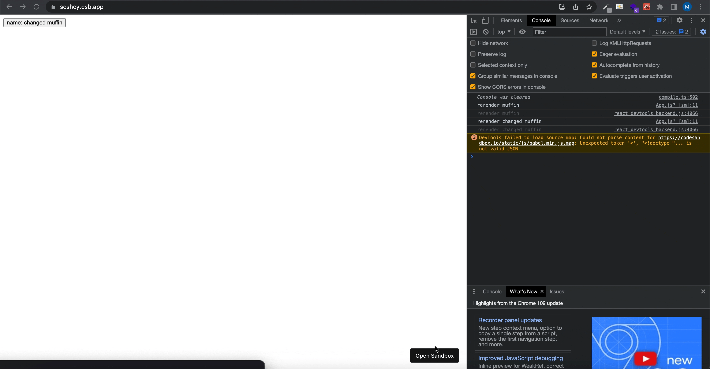
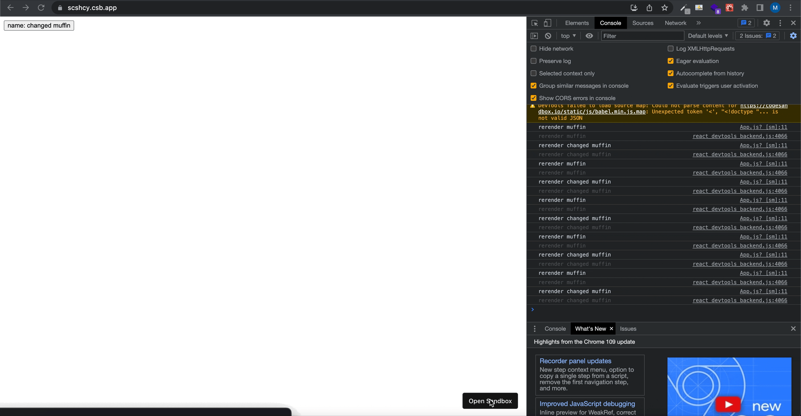

## useEffect Hooks ?

React Hooks중 useStaet 다음으로 가장 많이 쓰이는 이 useEffect 정확히 뭐하는 녀석일까 ? useEffect 함수는 컴포넌트가 render와 paint가 된 이후에 비동기로 처리해야 하는 부수적인 일들을 한다.

클래스형 기반 컴포넌트 라이플 싸이클의 3가지를 이 useEffect에서 다룬다.

1. componentDidMount: 컴포넌트를 만들고, 첫 렌더링을 다 마친 후 실행.

2. componentDidUpdate: 리렌더링을 완료한 후 실행. 즉 render()가 업데이트될 때마다 실행

3. compoenntWillUnMount: 컴포넌트를 DOM에서 제거할 때 실행.

사용하는 방법은 아래와 같다.

```javascript
// Component - mounting
useEffect(() => {
  console.log('맨 처음 렌더링될 때 한 번만 실행')
}, [])

// Component가 update
useEffect(() => {
  console.log('state값이 업데이트 될 때만 실행')
}, [state])

// Component가 unmount
useEffect(() => {
  console.log(state)
  return () => {
    console.log('cleanUp 함수')
  }
})
```

1. deps부분을 생략한다면 해당 컴포넌트가 렌더링 될 때마다 useEffect가 실행되게 된다. 만약 맨 처음 렌더링 될 때 한 번만 실행하고 싶다면 2번째 인자 deps에 빈 배열을 넣어주면 된다.

2. Component안에서 특정 state가 업데이트될 때만 실행하고 싶을 때는 deps위치의 배열 안에 실행 조건을 넣어주면된다.

3. Component가 언마운트 되었을 때(사라질 때) => useEffect는 함수를 반환할 수 있는데, 이 함수를 cleanup함수라 부른다.

지금까지 살펴본 useEffect에는 단점이 하나 존재한다. 그건, useEffect 함수 내부에 DOM에 영향을 주는 코드가 있을 경우에 사용자 입장에서 화면의 깜빡임 현상이 나타나 사용자 경험을 떨어트릴수 있는 문제다.

이에 대한 대안으로...


### useLayoutEffect

이 useLayoutEffect는 나도 존재만 알고 있었지, 거의 사용을 안해봤는데 이번 기회에 useEffect에 대하여 정리하면서 깊게 알게 되었다! 요 useLayoutEffect는 컴포넌트들이 렌더가 된 이후에 실행되며 그 이후에 paint가 된다. useEffect는 render와 paint가 같이 진행되지만 useLayoutEffect 그렇지 않고 동기적으로 실행이된다. 따라서 paint가 되기 전에는 dom을 조작하는 코드가 내부에 존재하더라도 사용자 입장에서는 깜빡임 현상이 없는것.

```javascript
const App = () => {
  const [name, setName] = useState('muffin')

  useLayoutEffect(() => {
    if (name === 'muffin') setName('changed muffin')
  }, [name])

  console.log('rerender', name)

  return <button onClick={() => setName('muffin')}>name: {name}</button>
}
```

1. 위 코드에서 useEffect를 사용 했을시



2. useLayouEffect를 사용 했을시



하지만, useLayoutEffect는 동기적으로 실행됙 때문에 내부 로직이 복잡하경우엔 사용자가 레이아웃을 보는데 까지는 시간이 오래 딜레이가 된다는 단점이 존재한다.

⭐️ useEffect & useLayoutEffect 요약

두 hook의 가장 큰 차이점은 실행 시점이고 더 자세한건 아래와 같다.

| useEffect                          | useLayoutEffect                                         |
| ---------------------------------- | ------------------------------------------------------- |
| 렌더링 - 화면 업데이트 - useEffect | 렌더링 - useLayoutEffect - 화면 업데이트                |
| 비동기                             | 동기                                                    |
| 서버로 통신, event handler         | 렌더링 바로 발생 후 DOM요소가 필요할때(scroll position) |
